## 4.1 Verificar acceso a Pipelines concedido

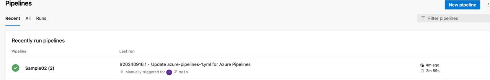
## 4.2 Agregar en pipeline YAML una tarea de Publish.
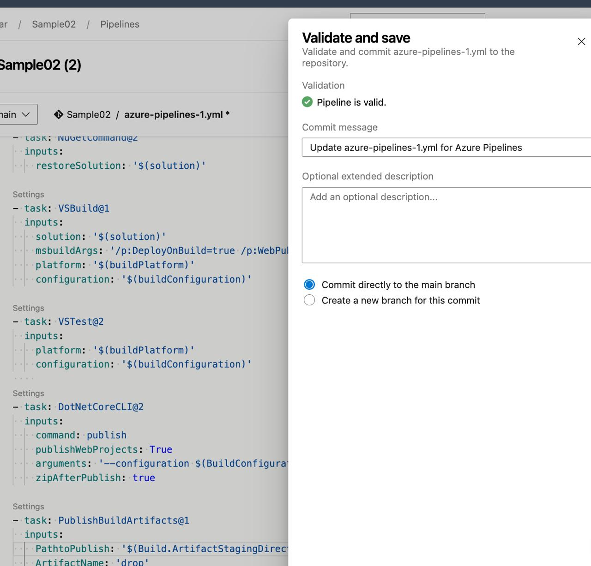
## 4.3 Explicar por qué es necesario contar con una tarea de Publish en un pipeline que corre en un agente de Microsoft en la nube.

La tarea de **Publish** es esencial porque los agentes en la nube de Microsoft son temporales. Sin esta tarea, los artefactos generados se perderían cuando el agente se destruye. Publicarlos en Azure DevOps asegura que estén disponibles para etapas posteriores, como despliegues, pruebas o revisiones, permitiendo además la colaboración entre equipos.

## 4.4 Descargar el resultado del pipeline y correr localmente el software compilado.
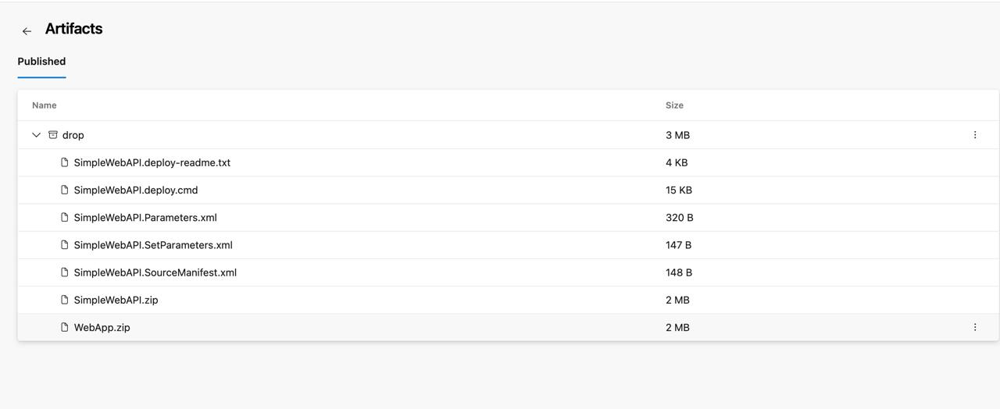
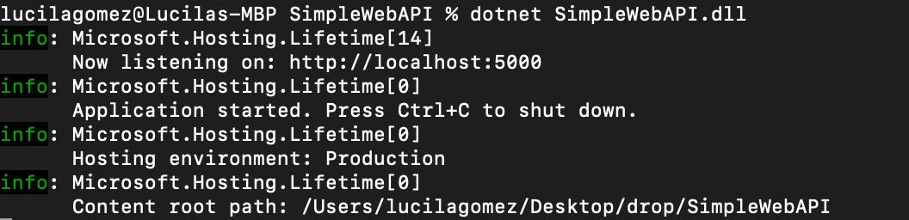

## 4.5 Habilitar el editor clásico de pipelines. Explicar las diferencias claves entre este tipo de editor y el editor YAML.
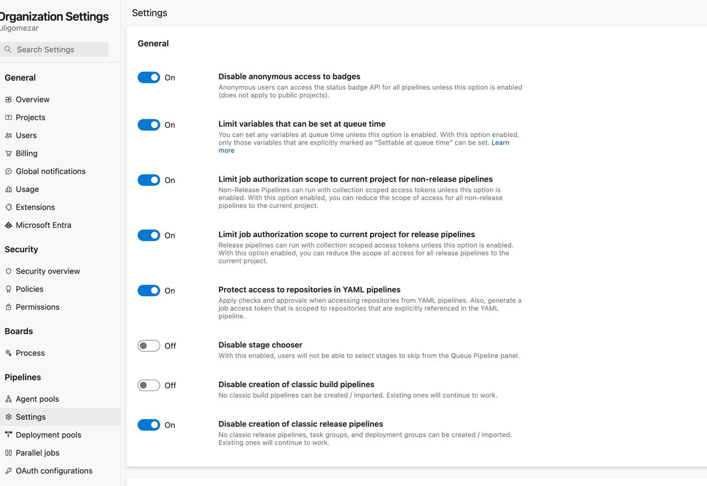

## 4.6 Crear un nuevo pipeline con el editor clásico. Descargar el resultado del pipeline y correr localmente el software compilado.
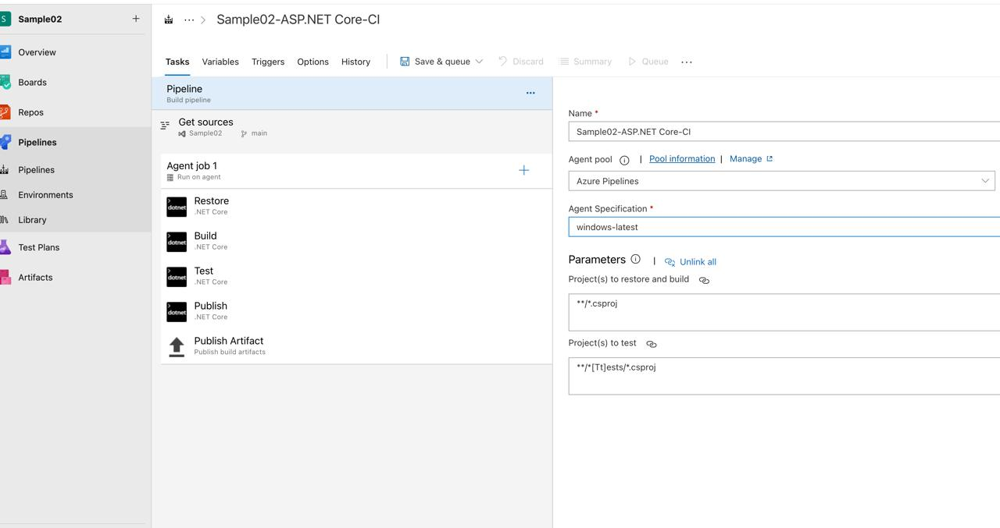

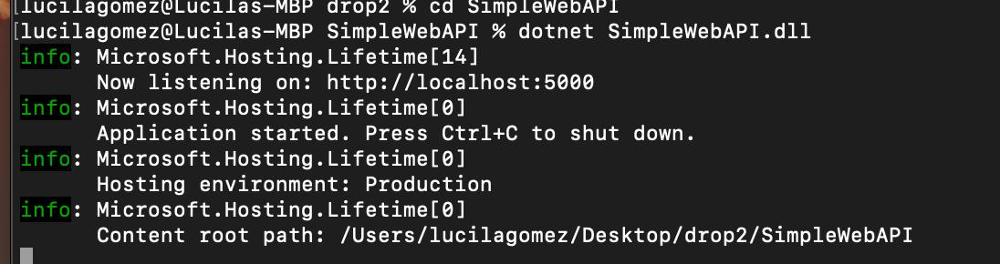

## 4.7 Configurar CI en ambos pipelines (YAML y Classic Editor). Mostrar resultados de la ejecución automática de ambos pipelines al hacer un commit en la rama main.
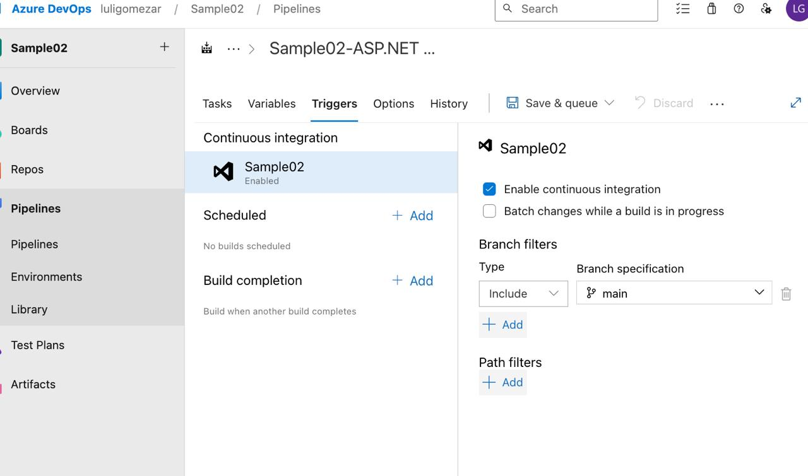
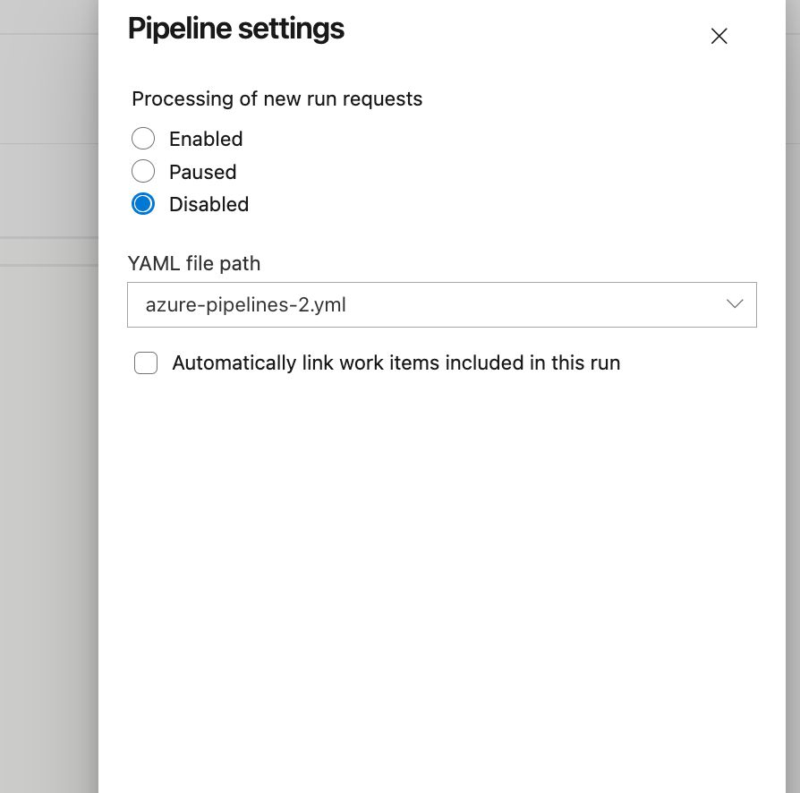
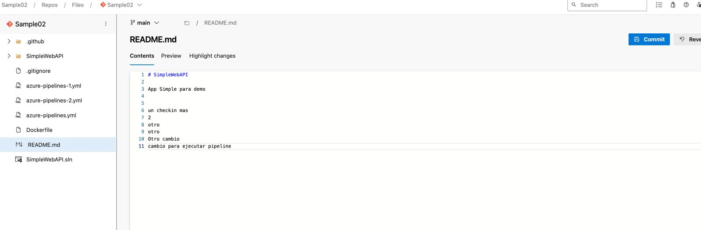
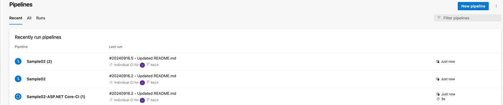

## 4.8 Explicar la diferencia entre un agente MS y un agente Self-Hosted. Qué ventajas y desventajas hay entre ambos? Cuándo es conveniente y/o necesario usar un Self-Hosted Agent?

Agente MS (Microsoft-hosted): Es un agente gestionado por Microsoft en la nube de Azure. Está preconfigurado con un entorno estándar, y se utiliza por demanda. Es efímero, es decir, se crea para cada ejecución del pipeline y se elimina al finalizar.
Agente Self-Hosted: Es un agente configurado y mantenido por el usuario en su infraestructura local o en la nube. El usuario tiene control total sobre el entorno y los recursos del agente.

Ventajas y Desventajas:

Agente MS:
Ventajas: Fácil de usar, no requiere configuración ni mantenimiento por parte del usuario, ideal para proyectos estándar. Desventajas: Menos control sobre el entorno, limitado a las configuraciones y herramientas preinstaladas, costos por tiempo de uso. Agente Self-Hosted:

Ventajas: Control total sobre el entorno y las herramientas, no tiene costos por tiempo de uso, ideal para necesidades específicas o software propietario. Desventajas: Requiere configuración, mantenimiento y administración del usuario, necesita recursos propios de infraestructura. Cuándo usar un Agente Self-Hosted:

Es conveniente usar un Agente Self-Hosted cuando necesitas configuraciones personalizadas, acceso a recursos locales, usar software propietario o específico, o cuando se requiere un mayor control y optimización del entorno de ejecución.

## 4.8 Crear un Pool de Agentes y un Agente Self-Hosted
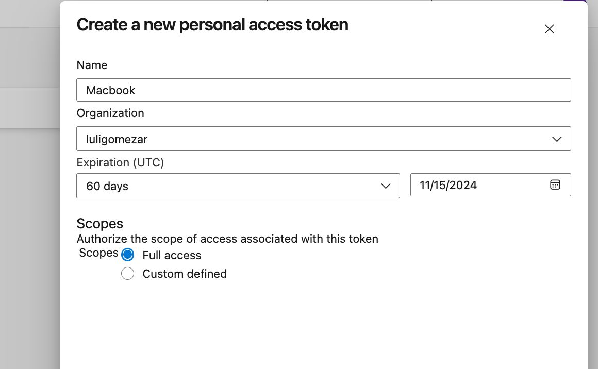
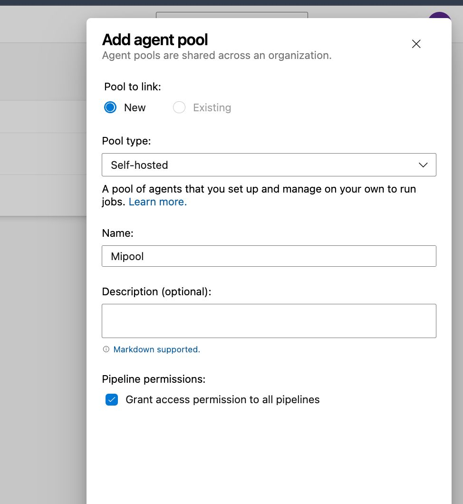

## 4.9 Instalar y correr un agente en nuestra máquina local.

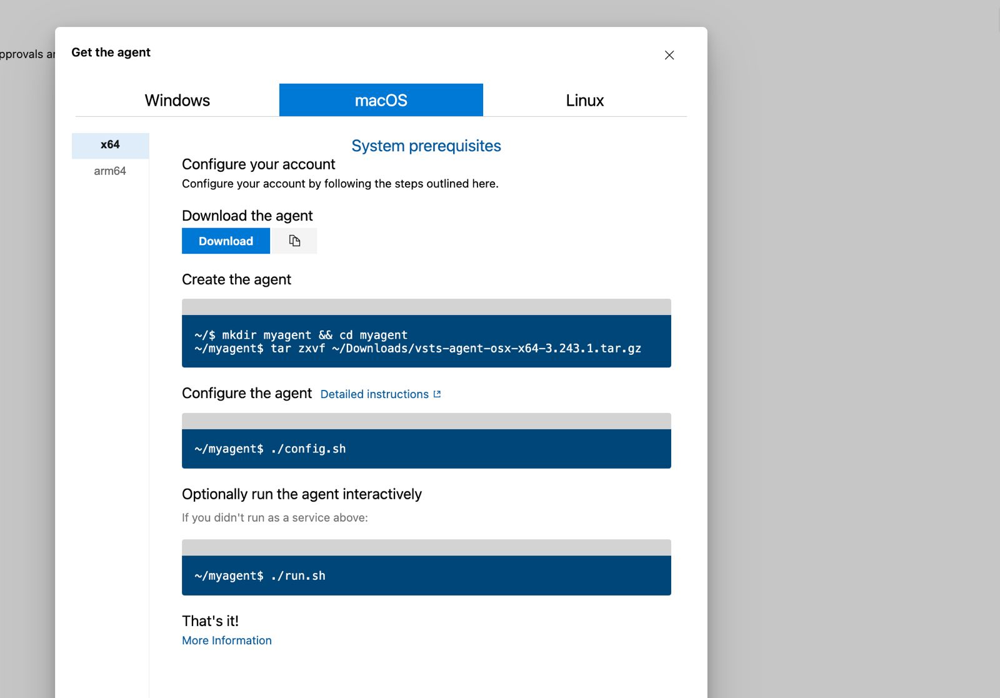

## 4.10 Crear un pipeline que use el agente Self-Hosted alojado en nuestra máquina local.

## 4.11 Buscar el resultado del pipeline y correr localmente el software compilado.

## 4.12 Crear un nuevo proyecto en ADO clonado desde un repo que contenga una aplicación en Angular como por ejemplo https://github.com/ingsoft3ucc/angular-demo-project.git

## 4.13 Configurar un pipeline de build para un proyecto de tipo Angular como el clonado.

## 4.14 Habilitar CI para el pipeline.

## 4.15 Hacer un cambio a un archivo del proyecto (algún cambio en el HTML que se renderiza por ejemplo) y verificar que se ejecute automáticamente el pipeline.

## 4.16 Descargar el resultado del pipeline y correr en un servidor web local el sitio construido.

## 4.17 Mostrar el antes y el después del cambio.
